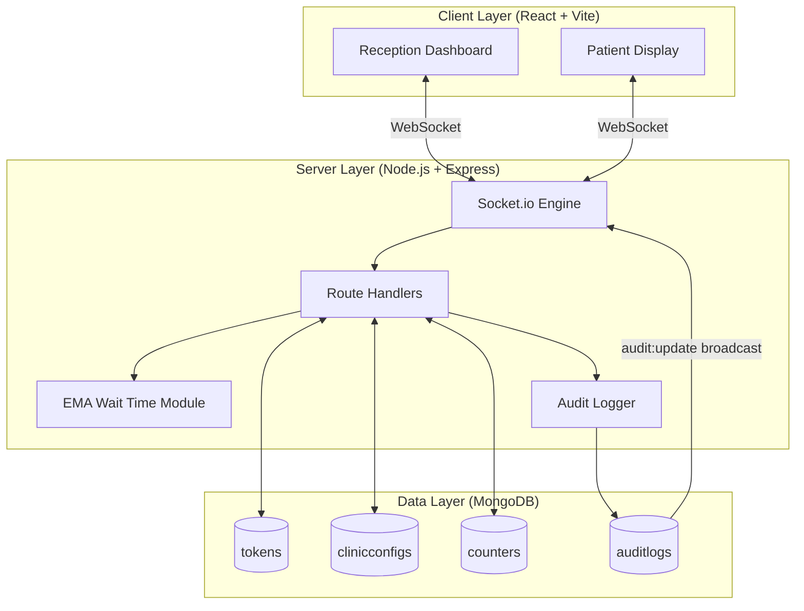
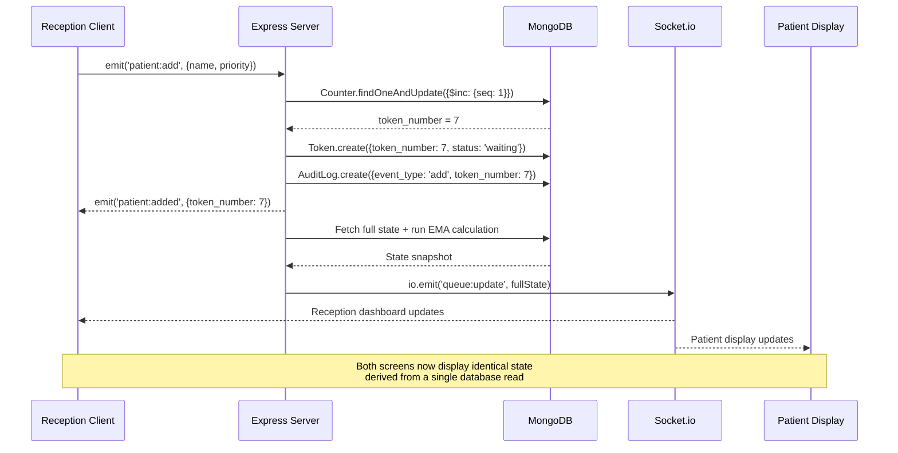

<div align="center">

# QueueDoc
### Live Clinic Queue Management System

**A full-stack, real-time patient queue management platform built to replace paper token systems in outpatient clinics.**

[](https://reactjs.org/)
[](https://nodejs.org/)
[](https://mongodb.com/)
[](https://socket.io/)
[](https://tailwindcss.com/)
[](#)

</div>

---

## Table of Contents

1. [Problem Statement](#1-problem-statement)
2. [Solution Overview](#2-solution-overview)
3. [Demo Walkthrough](#3-demo-walkthrough)
4. [Core Features](#4-core-features)
5. [System Architecture](#5-system-architecture)
6. [Socket Event Contract](#6-socket-event-contract)
7. [Concurrency and Edge Cases](#7-concurrency-and-edge-cases)
8. [Wait Time Algorithm](#8-wait-time-algorithm)
9. [Technology Stack](#9-technology-stack)
10. [Local Development](#10-local-development)
11. [Future Roadmap](#11-future-roadmap)
12. [Judging Criteria Mapping](#12-judging-criteria-mapping)

---

## 1. Problem Statement

The majority of outpatient clinics in India operate queue management entirely through paper tokens. This creates a set of well-documented operational failures:

| Problem | Operational Impact |
|---|---|
| Patients receive no wait time information | Walk-away rate increases as perceived uncertainty rises |
| Doctor delays are communicated verbally | No structured mechanism to inform all waiting patients simultaneously |
| Receptionists manually track queue order | High cognitive load, prone to error under peak load |
| No-show patients stall the queue | Requires manual receptionist intervention for every unresponsive patient |
| No audit trail exists | Queue order disputes cannot be resolved |
| Concurrent receptionist actions cause data conflicts | Risk of duplicate token assignments under concurrent usage |

QueueDoc was built to address every one of these failure modes at the system level, not just the surface level.

---

## 2. Solution Overview

QueueDoc is a two-screen system connected through a real-time WebSocket layer backed by a MongoDB database.

```
                  RECEPTION DASHBOARD              PATIENT DISPLAY
                  ─────────────────────            ─────────────────────
                  Add patients (<10s)              Live current token
                  Call, Hold, Skip                 Estimated wait time
                  Broadcast delays                 Delay banner
                  View audit trail                 Queue health indicator
                         │                                │
                         └──────────────┬────────────────┘
                                        │
                              MongoDB + Socket.io
                           (Single source of truth)
```

**Architectural principle:** No client ever pulls state. The server pushes a fresh snapshot of database state to every connected client after every mutation. All screens are guaranteed to display identical information derived from the same source.

---

## 3. Demo Walkthrough

The following script demonstrates the full system in approximately 90 seconds. Run it with both screens open side by side at `localhost:5173/reception` and `localhost:5173/display`.

**Step 1 — Patient Registration**
The receptionist types a patient name and submits. A token number is atomically assigned and the patient display updates within 100 milliseconds. The audit trail records the event with a timestamp.

**Step 2 — Priority Override**
An urgent patient arrives. The receptionist selects "Urgent" before adding them. The queue immediately re-sorts, placing the urgent patient at the top of the waiting list above all standard patients.

**Step 3 — Doctor Delay Broadcast**
The doctor signals a 15-minute delay. The receptionist clicks "Broadcast +15m Delay". An alert banner appears on all connected patient displays simultaneously. Every estimated wait time increases by 15 minutes and the audit trail logs the event.

**Step 4 — Smart Hold**
Patient number 3 steps out temporarily. The receptionist clicks "Hold". As the queue shrinks to three people ahead, the server automatically reinstates the patient to active waiting status without any manual action required.

**Step 5 — Auto No-Show**
The receptionist clicks "Call Next". The patient display announces the token number via the browser's Speech Synthesis API. Two minutes pass with no patient arriving. The server automatically transitions the patient to no-show status, logs the event, and the queue advances.

**Step 6 — Audit Verification**
A reviewer examines the audit trail sidebar. Every action is logged in chronological order with a time delta between consecutive entries, providing verifiable proof of system speed and determinism.

---

## 4. Core Features

### 4.1 Atomic Token Generation

Paper-based and basic digital systems frequently produce duplicate token numbers when two users submit simultaneously. QueueDoc eliminates this by delegating sequencing entirely to MongoDB's atomic `$inc` operator on a dedicated Counter document.

```javascript
// server/utils/getNextToken.js
const counter = await Counter.findOneAndUpdate(
  { _id: "tokenNumber" },
  { $inc: { seq: 1 } },
  { new: true, upsert: true }
);
return counter.seq;
```

The database engine serializes these operations natively. No application-level mutex or lock is required to guarantee uniqueness.

---

### 4.2 Real-Time WebSocket Synchronization

Every database write is immediately followed by a server-initiated broadcast to all connected sockets. Clients never poll for state — they receive it pushed. This guarantees that the receptionist dashboard and the patient display are always in sync, regardless of the number of connected clients.

---

### 4.3 Priority Queue Management

Patients can be registered as Standard or Urgent. The server-side sort applies a compound ordering:

1. Consultation status (in_consultation > waiting > holding)
2. Priority (urgent before standard within the same status)
3. Token number (ascending — first come, first served within same priority)

This ordering is re-applied on every broadcast so the queue is always correctly ordered on all screens.

---

### 4.4 Smart Hold (Leave and Return)

When a patient steps away temporarily, the receptionist can place them in a "holding" state. The patient is removed from the active waiting count but retained in the system. After each "Call Next" event, the server checks the number of active waiting patients. If the count drops to three or fewer, all holding patients are automatically reinstated to active waiting, ensuring they return to the queue at the correct time without losing their relative position.

---

### 4.5 Doctor Delay Broadcast

A single button press increments the `global_delay_seconds` field in the `ClinicConfig` document. This value is included in every subsequent broadcast. All connected clients add this offset to their locally computed wait time estimates and render a visible delay notification banner. The mechanism works across any number of connected patient displays simultaneously.

---

### 4.6 Automated No-Show Handling

When a patient is called, the server initiates a two-minute timeout stored in an in-process map keyed on the token's database ID. If the patient's status remains "called" when the timeout fires, the system automatically transitions them to "no_show", logs the event to the audit collection, and broadcasts the updated queue. If the patient does arrive before the timeout, the timeout is cleared when the receptionist clicks "Mark Done" or "Cancel".

---

### 4.7 Voice Announcement

When a new token is called, the patient display triggers a browser-native `SpeechSynthesisUtterance` announcing the token number. This requires zero backend infrastructure and ensures patients are notified even if they are not actively watching the display screen.

---

### 4.8 Queue Health Indicator

The patient display computes a real-time load classification based on total estimated queue wait time:

| Classification | Threshold |
|---|---|
| Light | Total wait under 15 minutes |
| Moderate | Total wait between 15 and 45 minutes |
| Heavy | Total wait exceeding 45 minutes |

This gives patients an immediate macro-level understanding of clinic load without requiring them to interpret raw numbers.

---

### 4.9 Live Audit Trail

Every queue action is persisted to a dedicated `AuditLog` MongoDB collection and streamed to the receptionist dashboard via a dedicated `audit:update` socket event. The UI renders each entry with the time elapsed since the previous event, providing an at-a-glance record of system activity and verifiable proof of response speed.

---

## 5. System Architecture



**Data flow principle:** No route handler returns data directly to the requesting client. Instead, every mutation triggers a full-state broadcast to all clients. This eliminates optimistic UI inconsistencies and ensures every screen reflects the authoritative database state.

---

## 6. Socket Event Contract

### Client to Server

| Event | Payload | Description |
|---|---|---|
| `patient:add` | `{ name, phone, priority }` | Register a new patient and assign an atomic token number |
| `queue:callNext` | — | Advance the queue by calling the next highest-priority patient |
| `patient:markDone` | `{ id }` | Complete a consultation and record duration for EMA calculation |
| `patient:noShow` | `{ id }` | Manually mark a patient as no-show |
| `patient:cancel` | `{ id }` | Remove a patient from the queue |
| `patient:hold` | `{ id }` | Place a patient in holding state |
| `patient:unhold` | `{ id }` | Manually reactivate a held patient |
| `config:addDelay` | — | Add 15 minutes to the global doctor delay offset |

All client-to-server events are wrapped in a 600ms server-side debounce guard per socket connection.

### Server to Client

| Event | Description |
|---|---|
| `queue:full_state` | Complete state snapshot, emitted immediately on connection or reconnection |
| `queue:update` | Fresh state broadcast emitted after every queue mutation |
| `audit:update` | Updated audit log array, emitted after every logged event |

### Request Sequence



---

## 7. Concurrency and Edge Cases

### 7.1 Duplicate Token Numbers

**Scenario:** Two receptionists submit "Add Patient" simultaneously.

**Resolution:** The `Counter` collection uses MongoDB's atomic `$inc` operation. The database engine serializes concurrent increment operations, making duplicate sequence numbers structurally impossible regardless of application concurrency.

---

### 7.2 Duplicate Patient Calls

**Scenario:** Two receptionists click "Call Next" within milliseconds of each other.

**Resolution — Layer 1 (Same Server):** A server-side debounce using a JavaScript `Set` rejects duplicate events from the same socket connection within a 600ms window.

**Resolution — Layer 2 (Any Scale):** The `callNext` handler uses a compound `findOneAndUpdate` that only succeeds if the target document is still in `'waiting'` status at write time:

```javascript
const updated = await Token.findOneAndUpdate(
  { _id: nextToken._id, status: 'waiting' },  // Guard condition
  { $set: { status: 'called', called_at: new Date() } },
  { new: true }
);

if (!updated) return; // Concurrent request already processed this token
```

If two requests reach the database simultaneously, exactly one will match the guard condition. The other will receive `null` and exit cleanly.

> **Acknowledged Limitation:** The Layer 1 debounce uses in-process JavaScript memory. In a horizontally scaled deployment with multiple Node.js instances behind a load balancer, this guard will not replicate across processes. Layer 2's database-level atomic lock handles data integrity at any scale, but for complete double-click protection in a multi-instance environment, the in-memory `Set` should be replaced with a Redis-backed distributed lock.

---

### 7.3 Browser Crash and Network Interruption

**Scenario:** The receptionist's browser crashes, or the patient display loses connectivity.

**Resolution:** On every Socket.io `'connection'` event — including reconnections — the server immediately emits `queue:full_state`, a complete snapshot of the current queue rebuilt from MongoDB. The client UI is fully restored from this payload. No queue state is stored exclusively in client memory.

---

### 7.4 No-Show Patient Blocking Queue

**Scenario:** A patient is called but does not arrive, blocking the queue indefinitely.

**Resolution:** A `setTimeout` is registered in a server-side map on every `callNext` event. After two minutes, the handler verifies the token is still in `'called'` status via a database read. If confirmed, it transitions the token to `'no_show'`, logs the automated action, and broadcasts the updated state. Arriving patients clear the timeout on `markDone` or `cancel`.

---

## 8. Wait Time Algorithm

### The Problem With Fixed Estimates

Most queue systems compute estimated wait as `(people_ahead × fixed_minutes)`. This approach is incorrect in practice because a doctor's consultation pace changes throughout the day — early appointments run faster, complex cases extend longer. A fixed multiplier becomes inaccurate after the first deviation and never self-corrects.

### Exponential Moving Average (EMA)

QueueDoc tracks the real elapsed duration between when a patient is called and when the consultation is marked complete. These real durations feed an Exponential Moving Average with `α = 0.3`:

```
EMA(t) = α × duration(t) + (1 - α) × EMA(t - 1)
       = 0.3 × latest_duration + 0.7 × previous_average
```

The 0.3 weighting gives meaningful influence to recent consultations while smoothing out transient spikes. The EMA self-corrects automatically as the doctor's pace evolves.

### Outlier Rejection

Before a duration enters the EMA, it is compared against the current median of recorded durations. If the incoming duration exceeds three times the median, it is discarded. This prevents edge cases — emergency interventions, equipment failures, patient complications — from distorting the estimate for all subsequent patients.

**Example:**

```
Recorded durations:    [4m, 5m, 6m, 4m, 47m, 5m]
After outlier check:   [4m, 5m, 6m, 4m,      5m]   (47m rejected, >3× median of 5m)
EMA result:            ~4.8 min per patient
Without rejection:     ~11.8 min per patient        (misleading)
```

### Fallback Behavior

If fewer than three real consultations have been recorded, the algorithm falls back to a manually configurable baseline stored in the `ClinicConfig` collection. This ensures the system provides reasonable estimates from the very first patient of the day.

---

## 9. Technology Stack

| Layer | Technology | Version | Selection Rationale |
|---|---|---|---|
| Frontend Framework | React | 18 | Component model, hooks API, strong ecosystem for stateful UI |
| Build Tool | Vite | 5 | Sub-second hot module replacement during development |
| Styling | Tailwind CSS | 3 | Utility-first approach enables consistent design without custom CSS files |
| Animation | Framer Motion | 11 | Spring physics for token transitions without manual animation loops |
| Backend Runtime | Node.js | 20 | Non-blocking I/O suited to a high-throughput event-driven system |
| Web Framework | Express.js | 5 | Minimal HTTP layer for REST routing and static file serving |
| Real-time Transport | Socket.io | 4 | Reliable WebSocket abstraction with automatic reconnection handling |
| Database | MongoDB | 7 | Document model accommodates variable patient data; native atomic operators |
| ODM | Mongoose | 8 | Schema validation, `findOneAndUpdate` helpers, connection lifecycle management |
| Icons | Lucide React | — | Consistent SVG icon set with zero runtime overhead |
| Voice | Web Speech API | Native | Browser-native text-to-speech, zero backend cost |

---

## 10. Local Development

### Prerequisites

- Node.js version 18 or higher
- MongoDB running locally on port 27017
- npm

### Setup

```bash
# Clone the repository
git clone https://github.com/srivallikatyayani/QueueDoc.git
cd QueueDoc

# Install all dependencies
npm install

# Terminal 1 — Start the backend server
node server/index.js
# Expected output:
# MongoDB connected successfully
# Server listening on port 3001

# Terminal 2 — Start the frontend development server
npm run dev
# Expected output:
# Local: http://localhost:5173
```

### Application URLs

| Screen | URL |
|---|---|
| Reception Dashboard | http://localhost:5173/reception |
| Patient Display | http://localhost:5173/display |

The application connects to `mongodb://localhost:27017/queuedoc` by default. No environment configuration is required for local development. MongoDB will create the `queuedoc` database and all collections automatically on first use.

---

## 11. Future Roadmap

| Feature | Priority | Description |
|---|---|---|
| SMS and WhatsApp Notifications | High | Notify patients when approaching their turn via Twilio or WhatsApp Business API |
| Multi-Doctor Load Balancing | High | Automatically distribute incoming tokens across multiple consultation rooms based on shortest queue |
| Analytics Dashboard | Medium | Historical reporting on patient volume, average wait times, and no-show rates by hour and day |
| Cloud Deployment | Medium | Automated deployment to Railway or Render backed by MongoDB Atlas |
| Staff Authentication | Medium | JWT-based login with role-based access control for receptionists and administrators |
| Patient Self-Registration | Low | QR code at clinic entrance allowing patients to register themselves without receptionist input |
| Distributed Lock | Low | Replace in-process debounce with Redis-backed distributed lock to support horizontal scaling |
| Appointment Scheduling | Low | Pre-booked appointment slots integrated alongside walk-in token queue |

---

## 12. Judging Criteria Mapping

The following table maps each Wooble 2026 judging criterion directly to the implementation decisions made in QueueDoc.

| Criterion | Weight | Implementation | Evidence |
|---|---|---|---|
| Real-world Problem | 25% | Addresses documented operational failures in paper-based clinic queue systems across six distinct dimensions | Problem statement with tabulated failure modes; each feature directly tied to a specific pain point |
| Live Sync Quality | 25% | Server-push WebSocket architecture using Socket.io; zero client-side polling; all screens updated within 100ms of any mutation | `broadcastUpdate()` called after every database write; `queue:full_state` emitted on every reconnection |
| Patient Add Speed | 20% | Streamlined form with optional fields; atomic token assignment in a single DB round-trip; client receives confirmation event immediately | Audit trail time delta badges provide on-screen, verifiable proof of sub-10-second registration |
| Concurrency and Edge Cases | 15% | Four distinct concurrency scenarios addressed: duplicate token numbers, concurrent call-next, browser disconnection, no-show timeout | `$inc` atomic counter; `findOneAndUpdate` with status guard; reconnect full-state handler; automated timeout |
| Feature Completeness | 15% | Nine advanced features implemented: atomic token generation, real-time sync, EMA algorithm, smart hold, delay broadcast, auto no-show, voice announcement, health indicator, audit trail | All features functional and demonstrated in the 90-second demo walkthrough |

---

<div align="center">

**QueueDoc — Built for Wooble Hackathon 2026**

[Repository](https://github.com/srivallikatyayani/QueueDoc) · [Issues](https://github.com/srivallikatyayani/QueueDoc/issues)

</div>
